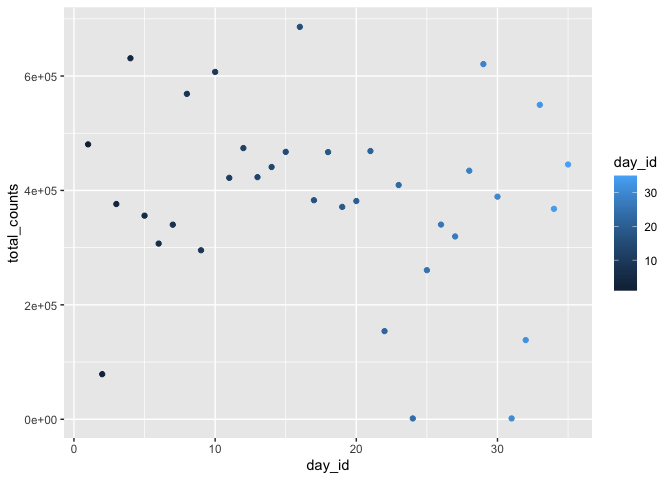

p8105_hw3_pl2848
================
Pei Liu
2022-10-12

import all the library needed

``` r
library(tidyverse)
```

    ## ── Attaching packages ─────────────────────────────────────── tidyverse 1.3.2 ──
    ## ✔ ggplot2 3.3.6      ✔ purrr   0.3.4 
    ## ✔ tibble  3.1.8      ✔ dplyr   1.0.10
    ## ✔ tidyr   1.2.0      ✔ stringr 1.4.1 
    ## ✔ readr   2.1.2      ✔ forcats 0.5.2 
    ## ── Conflicts ────────────────────────────────────────── tidyverse_conflicts() ──
    ## ✖ dplyr::filter() masks stats::filter()
    ## ✖ dplyr::lag()    masks stats::lag()

``` r
library(p8105.datasets)
library(dplyr)
```

# Problem 1

``` r
data("instacart")
```

1.  How many aisles are there, and which aisles are the most items
    ordered from?
2.  Make a plot that shows the number of items ordered in each aisle,
    limiting this to aisles with more than 10000 items ordered. Arrange
    aisles sensibly, and organize your plot so others can read it.
3.  Make a table showing the three most popular items in each of the
    aisles “baking ingredients”, “dog food care”, and “packaged
    vegetables fruits”. Include the number of times each item is ordered
    in your table.
4.  Make a table showing the mean hour of the day at which Pink Lady
    Apples and Coffee Ice Cream are ordered on each day of the week;
    format this table for human readers (i.e. produce a 2 x 7 table).

# Problem 2

Load, tidy, and otherwise wrangle the data. Your final dataset should
include all originally observed variables and values; have useful
variable names; include a weekday vs weekend variable; and encode data
with reasonable variable classes. Describe the resulting dataset
(e.g. what variables exist, how many observations, etc).

``` r
accel_data = read_csv("data/accel_data.csv") %>% 
  janitor::clean_names() %>% 
  pivot_longer(activity_1:activity_1440,
               names_to = "minutes",
               names_prefix = "activity_",
               values_to = "activity_counts") %>% 
  mutate(day = as.factor(day),
         day_type = 
           as.factor(ifelse(
             day == "Saturday" | day == "Sunday",
             "weekend", "weekday")),
         day_id = as.numeric(day_id),
         week = as.numeric(week),
         minutes = as.numeric(minutes))
```

    ## Rows: 35 Columns: 1443
    ## ── Column specification ────────────────────────────────────────────────────────
    ## Delimiter: ","
    ## chr    (1): day
    ## dbl (1442): week, day_id, activity.1, activity.2, activity.3, activity.4, ac...
    ## 
    ## ℹ Use `spec()` to retrieve the full column specification for this data.
    ## ℹ Specify the column types or set `show_col_types = FALSE` to quiet this message.

``` r
nrow(accel_data)
```

    ## [1] 50400

``` r
ncol(accel_data)
```

    ## [1] 6

``` r
head(accel_data, 10)
```

    ## # A tibble: 10 × 6
    ##     week day_id day    minutes activity_counts day_type
    ##    <dbl>  <dbl> <fct>    <dbl>           <dbl> <fct>   
    ##  1     1      1 Friday       1            88.4 weekday 
    ##  2     1      1 Friday       2            82.2 weekday 
    ##  3     1      1 Friday       3            64.4 weekday 
    ##  4     1      1 Friday       4            70.0 weekday 
    ##  5     1      1 Friday       5            75.0 weekday 
    ##  6     1      1 Friday       6            66.3 weekday 
    ##  7     1      1 Friday       7            53.8 weekday 
    ##  8     1      1 Friday       8            47.8 weekday 
    ##  9     1      1 Friday       9            55.5 weekday 
    ## 10     1      1 Friday      10            43.0 weekday

``` r
# Our tidy data set has 6 variables: week, day_id, day, minutes, activity_counts, and day_type.
# In total, there are 50400 observations.
# I also change the day and day_type to factoral variables, changed day_id, week and minutes to numeric variables.
```

Traditional analyses of accelerometer data focus on the total activity
over the day. Using your tidied dataset, aggregate across minutes to
create a total activity variable for each day, and create a table
showing these totals. Are any trends apparent?

``` r
library(data.table)
```

    ## 
    ## Attaching package: 'data.table'

    ## The following objects are masked from 'package:dplyr':
    ## 
    ##     between, first, last

    ## The following object is masked from 'package:purrr':
    ## 
    ##     transpose

``` r
total_activity = accel_data %>% 
  group_by(day_id) %>% 
  summarise(total_counts = sum(activity_counts))

table_total_activity = as.data.table(total_activity)
  
  
total_activity
```

    ## # A tibble: 35 × 2
    ##    day_id total_counts
    ##     <dbl>        <dbl>
    ##  1      1      480543.
    ##  2      2       78828.
    ##  3      3      376254 
    ##  4      4      631105 
    ##  5      5      355924.
    ##  6      6      307094.
    ##  7      7      340115.
    ##  8      8      568839 
    ##  9      9      295431 
    ## 10     10      607175 
    ## # … with 25 more rows

``` r
table_total_activity
```

    ##     day_id total_counts
    ##  1:      1    480542.62
    ##  2:      2     78828.07
    ##  3:      3    376254.00
    ##  4:      4    631105.00
    ##  5:      5    355923.64
    ##  6:      6    307094.24
    ##  7:      7    340115.01
    ##  8:      8    568839.00
    ##  9:      9    295431.00
    ## 10:     10    607175.00
    ## 11:     11    422018.00
    ## 12:     12    474048.00
    ## 13:     13    423245.00
    ## 14:     14    440962.00
    ## 15:     15    467420.00
    ## 16:     16    685910.00
    ## 17:     17    382928.00
    ## 18:     18    467052.00
    ## 19:     19    371230.00
    ## 20:     20    381507.00
    ## 21:     21    468869.00
    ## 22:     22    154049.00
    ## 23:     23    409450.00
    ## 24:     24      1440.00
    ## 25:     25    260617.00
    ## 26:     26    340291.00
    ## 27:     27    319568.00
    ## 28:     28    434460.00
    ## 29:     29    620860.00
    ## 30:     30    389080.00
    ## 31:     31      1440.00
    ## 32:     32    138421.00
    ## 33:     33    549658.00
    ## 34:     34    367824.00
    ## 35:     35    445366.00
    ##     day_id total_counts

``` r
trend_plot = total_activity %>% 
  ggplot(aes(x = day_id, y = total_counts, color = day_id)) + 
  geom_point() 
trend_plot
```

<!-- -->

``` r
# Looking at the scatter plot, we can see that the counts of activity is low at first, and increase until the minutes reach about 450. Then the counts fluctuates until around 1250. Then the counts drops dramatically to very low when minutes is around 1440.
```

Accelerometer data allows the inspection activity over the course of the
day. Make a single-panel plot that shows the 24-hour activity time
courses for each day and use color to indicate day of the week. Describe
in words any patterns or conclusions you can make based on this graph.

``` r
accel_data %>% 
  ggplot()
```

<!-- -->
