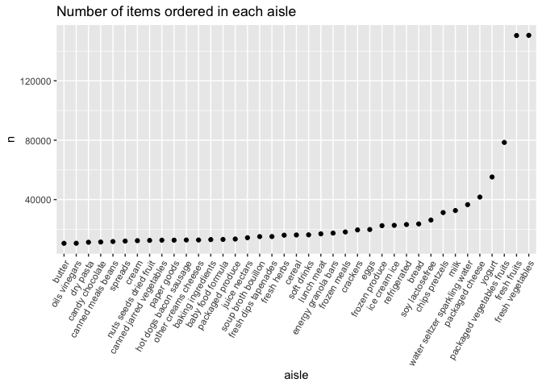
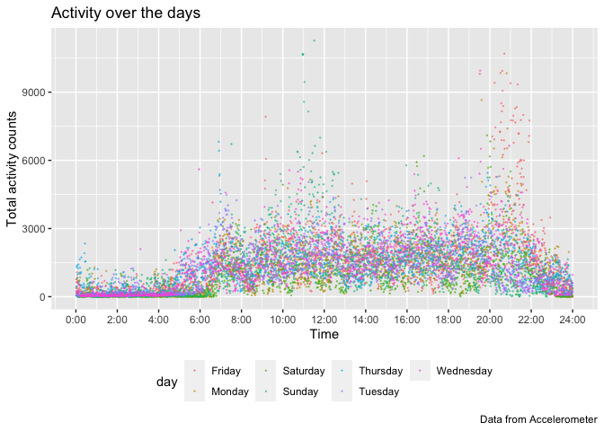
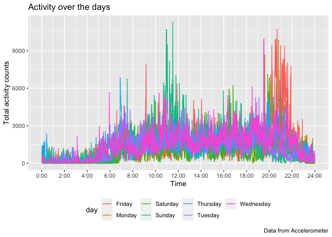
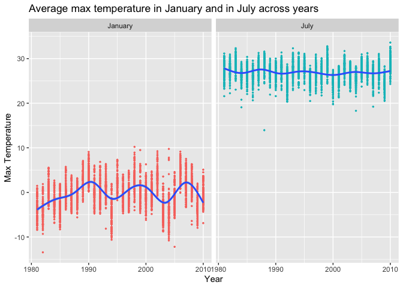
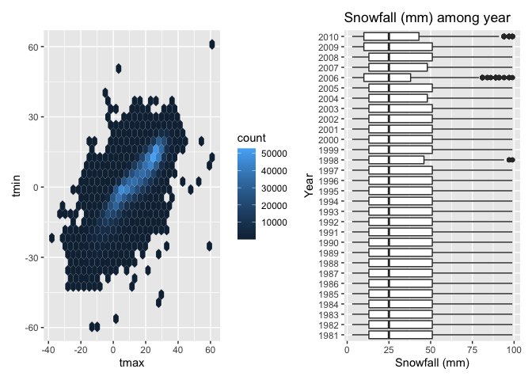

p8105_hw3_pl2848
================
Pei Liu
2022-10-12

import all the library needed

``` r
library(tidyverse)
```

    ## ── Attaching packages ─────────────────────────────────────── tidyverse 1.3.2 ──
    ## ✔ ggplot2 3.3.6      ✔ purrr   0.3.4 
    ## ✔ tibble  3.1.8      ✔ dplyr   1.0.10
    ## ✔ tidyr   1.2.0      ✔ stringr 1.4.1 
    ## ✔ readr   2.1.2      ✔ forcats 0.5.2 
    ## ── Conflicts ────────────────────────────────────────── tidyverse_conflicts() ──
    ## ✖ dplyr::filter() masks stats::filter()
    ## ✖ dplyr::lag()    masks stats::lag()

``` r
library(p8105.datasets)
library(dplyr)
```

# Problem 1

#### Read in the data

``` r
data("instacart")

instacart = 
  instacart %>% 
  as_tibble(instacart)
```

#### Answer questions about the data

This dataset contains 1384617 rows and 15 columns, with each row
resprenting a single product from an instacart order. Variables include
identifiers for user, order, and product; the order in which each
product was added to the cart. There are several order-level variables,
describing the day and time of the order, and number of days since prior
order. Then there are several item-specific variables, describing the
product name (e.g. Yogurt, Avocado), department (e.g. dairy and eggs,
produce), and aisle (e.g. yogurt, fresh fruits), and whether the item
has been ordered by this user in the past. In total, there are 39123
products found in 131209 orders from 131209 distinct users.

Below is a table summarizing the number of items ordered from aisle. In
total, there are 134 aisles, with fresh vegetables and fresh fruits
holding the most items ordered by far.

``` r
instacart %>% 
  count(aisle) %>% 
  arrange(desc(n))
```

    ## # A tibble: 134 × 2
    ##    aisle                              n
    ##    <chr>                          <int>
    ##  1 fresh vegetables              150609
    ##  2 fresh fruits                  150473
    ##  3 packaged vegetables fruits     78493
    ##  4 yogurt                         55240
    ##  5 packaged cheese                41699
    ##  6 water seltzer sparkling water  36617
    ##  7 milk                           32644
    ##  8 chips pretzels                 31269
    ##  9 soy lactosefree                26240
    ## 10 bread                          23635
    ## # … with 124 more rows

Next is a plot that shows the number of items ordered in each aisle.
Here, aisles are ordered by ascending number of items.

``` r
instacart %>% 
  count(aisle) %>% 
  filter(n > 10000) %>% 
  mutate(aisle = fct_reorder(aisle, n)) %>% 
  ggplot(aes(x = aisle, y = n)) + 
  geom_point() + 
  labs(title = "Number of items ordered in each aisle") +
  theme(axis.text.x = element_text(angle = 60, hjust = 1))
```

<!-- -->

Our next table shows the three most popular items in aisles
`baking ingredients`, `dog food care`, and `packaged vegetables fruits`,
and includes the number of times each item is ordered in your table.

``` r
instacart %>% 
  filter(aisle %in% c("baking ingredients", "dog food care", "packaged vegetables fruits")) %>%
  group_by(aisle) %>% 
  count(product_name) %>% 
  mutate(rank = min_rank(desc(n))) %>% 
  filter(rank < 4) %>% 
  arrange(desc(n)) %>%
  knitr::kable()
```

| aisle                      | product_name                                  |    n | rank |
|:---------------------------|:----------------------------------------------|-----:|-----:|
| packaged vegetables fruits | Organic Baby Spinach                          | 9784 |    1 |
| packaged vegetables fruits | Organic Raspberries                           | 5546 |    2 |
| packaged vegetables fruits | Organic Blueberries                           | 4966 |    3 |
| baking ingredients         | Light Brown Sugar                             |  499 |    1 |
| baking ingredients         | Pure Baking Soda                              |  387 |    2 |
| baking ingredients         | Cane Sugar                                    |  336 |    3 |
| dog food care              | Snack Sticks Chicken & Rice Recipe Dog Treats |   30 |    1 |
| dog food care              | Organix Chicken & Brown Rice Recipe           |   28 |    2 |
| dog food care              | Small Dog Biscuits                            |   26 |    3 |

Finally is a table showing the mean hour of the day at which Pink Lady
Apples and Coffee Ice Cream are ordered on each day of the week. This
table has been formatted in an untidy manner for human readers. Pink
Lady Apples are generally purchased slightly earlier in the day than
Coffee Ice Cream, with the exception of day 5.

``` r
instacart %>%
  filter(product_name %in% c("Pink Lady Apples", "Coffee Ice Cream")) %>%
  group_by(product_name, order_dow) %>%
  summarize(mean_hour = mean(order_hour_of_day)) %>%
  spread(key = order_dow, value = mean_hour) %>%
  knitr::kable(digits = 2)
```

    ## `summarise()` has grouped output by 'product_name'. You can override using the
    ## `.groups` argument.

| product_name     |     0 |     1 |     2 |     3 |     4 |     5 |     6 |
|:-----------------|------:|------:|------:|------:|------:|------:|------:|
| Coffee Ice Cream | 13.77 | 14.32 | 15.38 | 15.32 | 15.22 | 12.26 | 13.83 |
| Pink Lady Apples | 13.44 | 11.36 | 11.70 | 14.25 | 11.55 | 12.78 | 11.94 |

# Problem 2

## Question 1

Load, tidy, and otherwise wrangle the data. Your final dataset should
include all originally observed variables and values; have useful
variable names; include a weekday vs weekend variable; and encode data
with reasonable variable classes. Describe the resulting dataset
(e.g. what variables exist, how many observations, etc).

``` r
# I also change the day and day_type to factorial variables, changed day_id, week and minutes to numeric variables.
accel_data = read_csv("data/accel_data.csv") %>% 
  janitor::clean_names() %>% 
  pivot_longer(activity_1:activity_1440,
               names_to = "minutes",
               names_prefix = "activity_",
               values_to = "activity_counts") %>% 
  mutate(day = as.factor(day),
         day_type = 
           as.factor(ifelse(
             day == "Saturday" | day == "Sunday",
             "weekend", "weekday")),
         day_id = as.numeric(day_id),
         week = as.numeric(week),
         minutes = as.numeric(minutes))
```

    ## Rows: 35 Columns: 1443
    ## ── Column specification ────────────────────────────────────────────────────────
    ## Delimiter: ","
    ## chr    (1): day
    ## dbl (1442): week, day_id, activity.1, activity.2, activity.3, activity.4, ac...
    ## 
    ## ℹ Use `spec()` to retrieve the full column specification for this data.
    ## ℹ Specify the column types or set `show_col_types = FALSE` to quiet this message.

``` r
nrow(accel_data)
```

    ## [1] 50400

``` r
ncol(accel_data)
```

    ## [1] 6

``` r
head(accel_data, 10)
```

    ## # A tibble: 10 × 6
    ##     week day_id day    minutes activity_counts day_type
    ##    <dbl>  <dbl> <fct>    <dbl>           <dbl> <fct>   
    ##  1     1      1 Friday       1            88.4 weekday 
    ##  2     1      1 Friday       2            82.2 weekday 
    ##  3     1      1 Friday       3            64.4 weekday 
    ##  4     1      1 Friday       4            70.0 weekday 
    ##  5     1      1 Friday       5            75.0 weekday 
    ##  6     1      1 Friday       6            66.3 weekday 
    ##  7     1      1 Friday       7            53.8 weekday 
    ##  8     1      1 Friday       8            47.8 weekday 
    ##  9     1      1 Friday       9            55.5 weekday 
    ## 10     1      1 Friday      10            43.0 weekday

``` r
# # In total, there are 50400 observations. Our tidy data set has 6 variables: week, day_id, day, minutes, activity_counts, and day_type. 
# week is a numeric variable indicating which week is the data been collected, ranged from 1-5;
# day_id is a numeric variable indicating the number of day that the data been collected, ranged from 1 to 35.
# day is a factor variable indicating which day of the week the data been collected
# minutes is a numeric variable indicating the collected minute of the data
# activity_counts is a numeric variable, documenting the activity counts recorded by the accelerometer by minutes
# day_type is a factor variable, indicating whether the day is weekday or weekend
```

## Question 2

Traditional analyses of accelerometer data focus on the total activity
over the day. Using your tidied dataset, aggregate across minutes to
create a total activity variable for each day, and create a table
showing these totals. Are any trends apparent?

``` r
total_activity = accel_data %>% 
  group_by(day, week) %>% 
  summarise(total_counts = sum(activity_counts)) %>% 
  pivot_wider(
    names_from = day,
    values_from = total_counts
  ) 
```

    ## `summarise()` has grouped output by 'day'. You can override using the `.groups`
    ## argument.

``` r
knitr::kable(total_activity)
```

| week |   Friday |    Monday | Saturday | Sunday | Thursday |  Tuesday | Wednesday |
|-----:|---------:|----------:|---------:|-------:|---------:|---------:|----------:|
|    1 | 480542.6 |  78828.07 |   376254 | 631105 | 355923.6 | 307094.2 |    340115 |
|    2 | 568839.0 | 295431.00 |   607175 | 422018 | 474048.0 | 423245.0 |    440962 |
|    3 | 467420.0 | 685910.00 |   382928 | 467052 | 371230.0 | 381507.0 |    468869 |
|    4 | 154049.0 | 409450.00 |     1440 | 260617 | 340291.0 | 319568.0 |    434460 |
|    5 | 620860.0 | 389080.00 |     1440 | 138421 | 549658.0 | 367824.0 |    445366 |

``` r
head(total_activity)
```

    ## # A tibble: 5 × 8
    ##    week  Friday  Monday Saturday Sunday Thursday Tuesday Wednesday
    ##   <dbl>   <dbl>   <dbl>    <dbl>  <dbl>    <dbl>   <dbl>     <dbl>
    ## 1     1 480543.  78828.   376254 631105  355924. 307094.   340115.
    ## 2     2 568839  295431    607175 422018  474048  423245    440962 
    ## 3     3 467420  685910    382928 467052  371230  381507    468869 
    ## 4     4 154049  409450      1440 260617  340291  319568    434460 
    ## 5     5 620860  389080      1440 138421  549658  367824    445366

``` r
# The total activity on Saturday at week 4 and 5 is extrmely small compared to other days. 
#Week 1: Sunday has most counts, and Friday has the second active activity, while monday has least activity; 
# week 2: Saturday has most activity and Monday has the least activity;
# Week 3: Monday has most active activity and Thursday has the least activity
# Week 4: Wednesday has most activity counts, Saturday has the least counts.
# Week 5: Friday has the most activity, Saturady has the least
# So the most active day is usually the weekend or the day before/after the weekend.  
```

## Question 3

Accelerometer data allows the inspection activity over the course of the
day. Make a single-panel plot that shows the 24-hour activity time
courses for each day and use color to indicate day of the week. Describe
in words any patterns or conclusions you can make based on this graph.

``` r
total_activity_min = accel_data %>% 
  group_by(day, minutes) %>% 
  summarise(total_counts = sum(activity_counts))
```

    ## `summarise()` has grouped output by 'day'. You can override using the `.groups`
    ## argument.

``` r
total_activity_min
```

    ## # A tibble: 10,080 × 3
    ## # Groups:   day [7]
    ##    day    minutes total_counts
    ##    <fct>    <dbl>        <dbl>
    ##  1 Friday       1        766. 
    ##  2 Friday       2        627. 
    ##  3 Friday       3       1077. 
    ##  4 Friday       4        852. 
    ##  5 Friday       5        587. 
    ##  6 Friday       6        175. 
    ##  7 Friday       7        694. 
    ##  8 Friday       8        577. 
    ##  9 Friday       9         90.5
    ## 10 Friday      10        366. 
    ## # … with 10,070 more rows

``` r
# I prepared the data for my ggplot in this step.
```

``` r
trend_plot = total_activity_min %>% 
  ggplot(aes(x = minutes, y = total_counts, color = day)) + 
  geom_point(aes(color = day), alpha = .5, size = 0.1)  +
  scale_x_continuous(breaks = seq(0, 1440, by = 120),
                    labels = c("0:00", "2:00", "4:00", "6:00", "8:00", "10:00", "12:00", "14:00", "16:00", "18:00" , "20:00", "22:00", "24:00")
                     ) +
  labs(
    title = "Activity over the days",
    x = "Time",
    y = "Total activity counts",
    caption = "Data from Accelerometer") +
  theme(legend.position = "bottom")
  
trend_plot
```

<!-- -->

``` r
trend_plot +  geom_line()
```

<!-- -->

``` r
# Looking at the scatter plot, we can see that the counts of activity is very low midnight (during the sleep time), and starts to increase after about 6. Then the counts reach the first peak around 12:00 (11:00. Then the counts drops around 13:00, and fluctuated until 20:00 to 22:00, where the activity reached the second peak. Then the activity drops after around 23:00.
```

# Problem 3

This problem uses the NY NOAA data. DO NOT include this dataset in your
local data directory; instead, load the data from the p8105.datasets
package using:

``` r
# Loaded the data
library(p8105.datasets)
data("ny_noaa")
```

The goal is to do some exploration of this dataset. To that end, write a
short description of the dataset, noting the size and structure of the
data, describing some key variables, and indicating the extent to which
missing data is an issue. Then, do or answer the following (commenting
on the results of each):

## Question 1

Do some data cleaning. Create separate variables for year, month, and
day. Ensure observations for temperature, precipitation, and snowfall
are given in reasonable units.

``` r
# For this step, I seperate the date variable into year, month and day. I adjust the units for prcp by deviding original prcp by 10, and do the same thing for tmax and tmin.
library(lubridate)
```

    ## 
    ## Attaching package: 'lubridate'

    ## The following objects are masked from 'package:base':
    ## 
    ##     date, intersect, setdiff, union

``` r
ny_noaa_clean = ny_noaa %>% 
  mutate(year = year(date),
         month = month(date), 
         day = day(date),
         prcp = prcp/10 , 
         tmax = as.numeric(tmax)/10,  
         tmin = as.numeric(tmin)/10) %>% 
  arrange(date)

# Description:
# There are 2595176 observations.  I preserved the data variable, so there are 10 variables in this data set.
#The key variables are: date (yyyy-mm-dd format) ,  day, month and year (the separated variables from date, they are all numeric variables)  , id (the observation station, chracteristic variable), prcp (Precipitation (mm)) , snow (Snowfall (mm)) , snwd (Snow depth (mm)),  tmax (Maximum temperature (degrees C)) ,  tmin (Minimum temperature (degrees C) ).
head(ny_noaa_clean, 100)
```

    ## # A tibble: 100 × 10
    ##    id          date        prcp  snow  snwd  tmax  tmin  year month   day
    ##    <chr>       <date>     <dbl> <int> <int> <dbl> <dbl> <dbl> <dbl> <int>
    ##  1 USC00300023 1981-01-01   0       0     0  -5.6  NA    1981     1     1
    ##  2 USC00300055 1981-01-01   0       0    76  -5   -12.8  1981     1     1
    ##  3 USC00300063 1981-01-01   0      NA    NA  -8.3 -15    1981     1     1
    ##  4 USC00300085 1981-01-01   0.3     3   102  -4.4 -13.9  1981     1     1
    ##  5 USC00300093 1981-01-01   0      NA   102  -3.9 -12.8  1981     1     1
    ##  6 USC00300183 1981-01-01   0       0    76  -3.3 -11.7  1981     1     1
    ##  7 USC00300220 1981-01-01   0       0   203  -3.9 -12.2  1981     1     1
    ##  8 USC00300254 1981-01-01   0       0    NA  NA    NA    1981     1     1
    ##  9 USC00300331 1981-01-01   0       0    51  -7.2 -14.4  1981     1     1
    ## 10 USC00300343 1981-01-01   0       0   127  NA    NA    1981     1     1
    ## # … with 90 more rows

``` r
ls(ny_noaa_clean)
```

    ##  [1] "date"  "day"   "id"    "month" "prcp"  "snow"  "snwd"  "tmax"  "tmin" 
    ## [10] "year"

``` r
nrow(ny_noaa_clean)
```

    ## [1] 2595176

``` r
ncol(ny_noaa_clean)
```

    ## [1] 10

``` r
ny_noaa_clean %>% 
  summarise_all(~sum(is.na(.)))
```

    ## # A tibble: 1 × 10
    ##      id  date   prcp   snow   snwd    tmax    tmin  year month   day
    ##   <int> <int>  <int>  <int>  <int>   <int>   <int> <int> <int> <int>
    ## 1     0     0 145838 381221 591786 1134358 1134420     0     0     0

``` r
# I used above code to check the number of NA for each variables. As it is shown, the numbers of NA's are listed below:
# prcp: 145838
# snow: 381221
# snwd: 591786
# tmax: 1134358
# tmin: 1134420
# There are great numbers of NA in this dataset. So how to handling these NA are important to the results. For me, I didn't drop all of the NA in the cleaned dataset, because I want to operate on these NAs separately later in analysis, so that I can preserve as much data as possible. 
```

For snowfall, what are the most commonly observed values? Why?

``` r
# In this step, I calculated the frequency of snow (mm)
snow_freq = ny_noaa_clean %>% 
  drop_na(snow) %>% 
  count(snow) %>% 
  arrange(desc(n))

snow_freq
```

    ## # A tibble: 281 × 2
    ##     snow       n
    ##    <int>   <int>
    ##  1     0 2008508
    ##  2    25   31022
    ##  3    13   23095
    ##  4    51   18274
    ##  5    76   10173
    ##  6     8    9962
    ##  7     5    9748
    ##  8    38    9197
    ##  9     3    8790
    ## 10   102    6552
    ## # … with 271 more rows

``` r
# For snowfall, what are the most commonly observed values? Why?
# The most commonly observed values are 0. Because it wouldn't snow everyday, especially in seasons other than winter. So most of the values are 0.
```

## Question 2

Make a two-panel plot showing the average max temperature in January and
in July in each station across years. Is there any observable /
interpretable structure? Any outliers?

``` r
# I prepare the data for ploting. I only drop tmax = na here, because that's the variable that I am interested in. I also changed month from numer to its name. 
ny_noaa_clean %>% 
  drop_na(tmax) %>% 
  filter(month == 1 | month == 7) %>% 
  mutate (month = month.name[month]) %>% 
  group_by(year, month, id) %>% 
  summarize(avg_tmax = mean(tmax)) %>% 
# x-axis is year, y axis is avg_tmax. I also separate them by month, so that there are two plots.
  ggplot(aes(x = year, y = avg_tmax)) +
  geom_point(aes(color = month), size = 0.5)+
  theme(legend.position = "none")+
  facet_grid(.~ month) + 
  labs(
    title = "Average max temperature in January and in July across years",
    x = "Year",
    y = "Max Temperature") +
  geom_smooth()
```

    ## `summarise()` has grouped output by 'year', 'month'. You can override using the
    ## `.groups` argument.
    ## `geom_smooth()` using method = 'gam' and formula 'y ~ s(x, bs = "cs")'

<!-- -->

``` r
# The temperatures in January is significantly lower than it is in July. The mean temperature of January fluctuated around 0 Celsius, and the range of the temperature is wider. The temperature in July over years is more stable, with less fluctuation around 27 Celsius, with less range. 
# We can see from the plot that there are two obvious outliers in January around 1982 and 2005 The temperatures were below -10 Celsius. For temperatures in July, there is one obvious outlier around 1988, the temperature was below 15 Celsius. 
```

## Question 3

Make a two-panel plot showing (i) tmax vs tmin for the full dataset
(note that a scatterplot may not be the best option); and (ii) make a
plot showing the distribution of snowfall values greater than 0 and less
than 100 separately by year.

``` r
library(ggridges)
# (i) tmax vs tmin for the full dataset
p1 = ny_noaa_clean %>%  
  drop_na(tmax, tmin) %>% 
  ggplot(aes(x = tmax, y = tmin)) + 
  geom_hex()

# (ii) make a plot showing the distribution of snowfall values greater than 0 and less than 100 separately by year
p2 = ny_noaa_clean %>%  
  drop_na(snow) %>% 
  filter(snow > 0 & snow < 100) %>% 
  select(year, snow) %>% 
  ggplot(aes(x = snow, y = as.factor(year))) +
  geom_boxplot() +
  labs(
    title = "Snowfall (mm) among year",
    x = "Snowfall (mm)",
    y = "Year")

# I loaded library patchwork here to create the two penel plot
library(patchwork)
p1+p2 
```

<!-- -->
